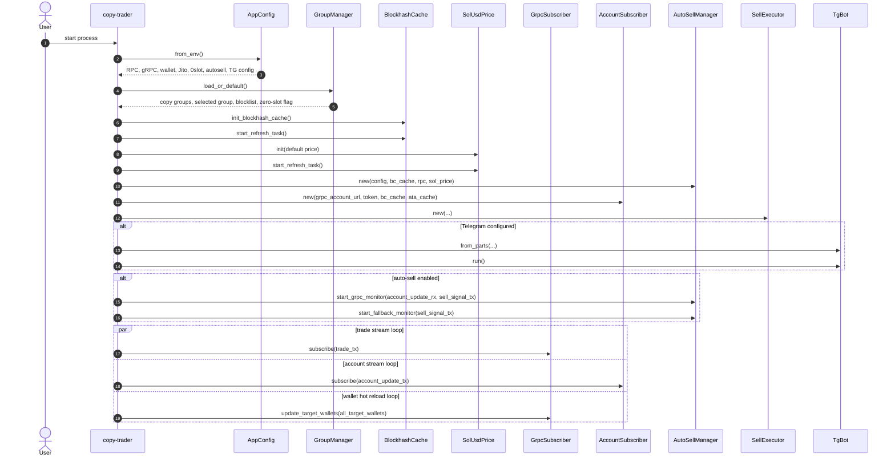
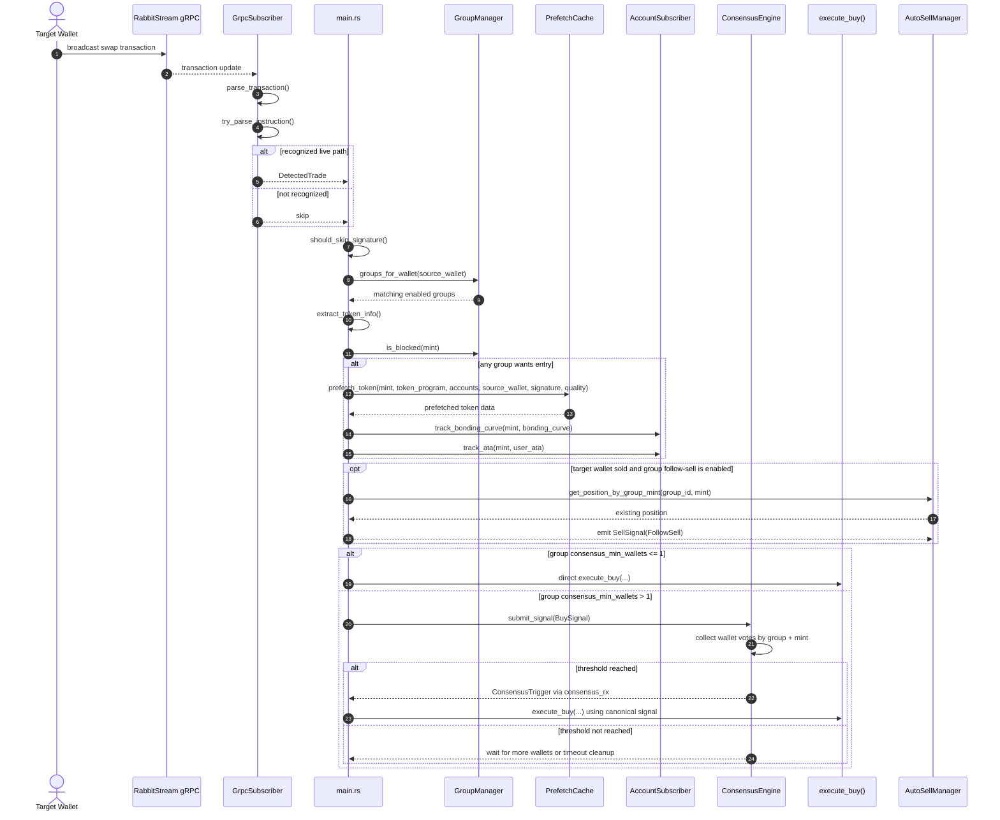
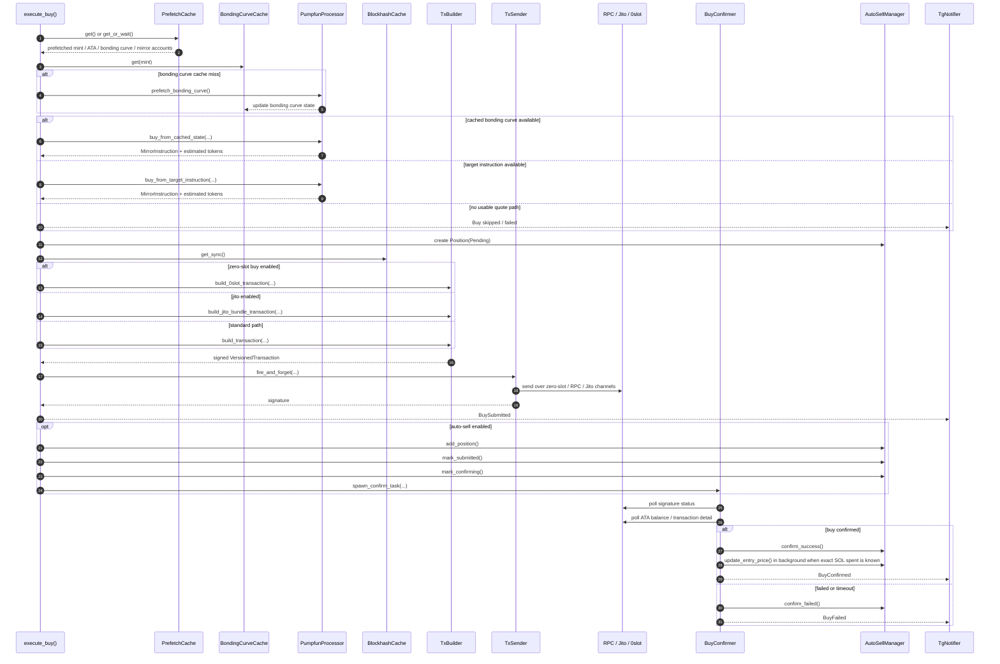
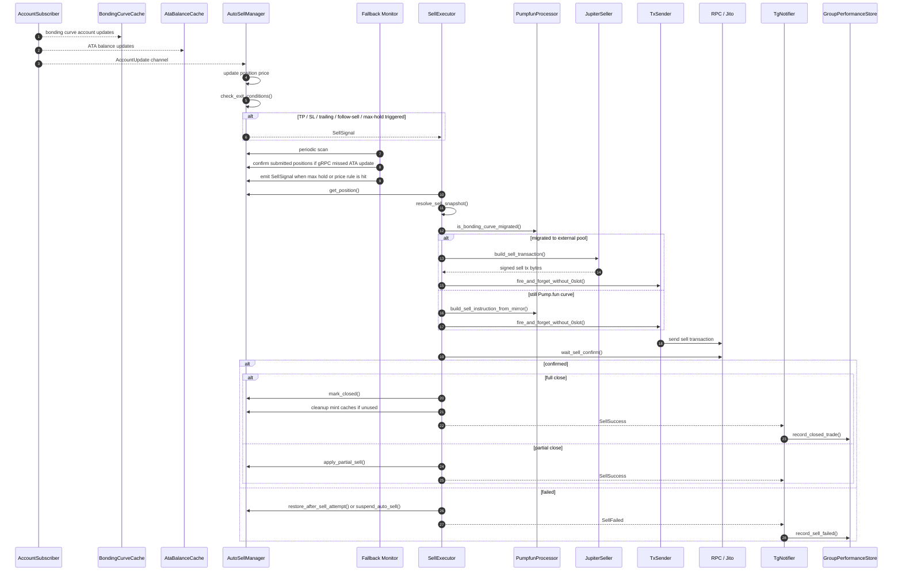
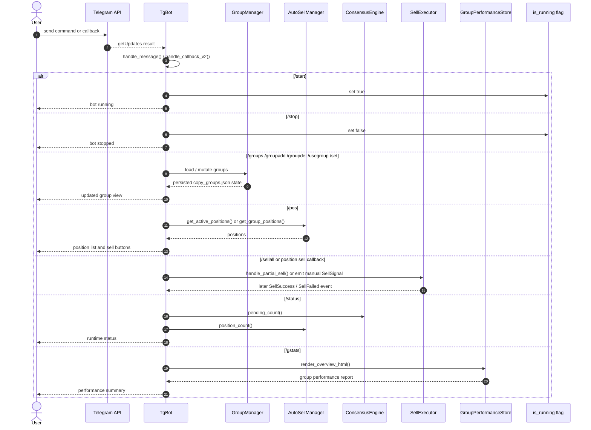

# Project Sequence Diagram

This document captures the current runtime sequence of the `copy-trader` system.

Scope:
- binary startup
- live trade intake
- consensus and buy execution
- buy confirmation and position activation
- auto-sell monitoring and sell execution
- Telegram control plane

Important current limitation:
- The runtime parser in `src/grpc/subscriber.rs` currently only feeds Pump.fun trades into the main execution path.
- PumpSwap / Raydium processors exist in `src/processor/`, but they are not fully wired into the live trade intake path yet.

## 1. Startup And Runtime Wiring

## 2. Trade Intake To Buy Trigger

## 3. Buy Execution And Confirmation

## 4. Auto-Sell Monitoring And Sell Execution

## 5. Telegram Control Plane

## Source Map

- `src/main.rs`
  - startup and orchestration
  - trade intake loop
  - direct buy path
  - consensus-triggered buy path
- `src/config.rs`
  - env config loading
- `src/groups.rs`
  - group persistence and wallet-to-group mapping
- `src/grpc/subscriber.rs`
  - live trade parsing
- `src/grpc/account_subscriber.rs`
  - live bonding curve and ATA updates
- `src/processor/pumpfun.rs`
  - Pump.fun quote logic and mirror instruction construction
- `src/tx/builder.rs`
  - V0 transaction assembly
- `src/tx/sender.rs`
  - multi-channel low-latency send path
- `src/tx/confirm.rs`
  - buy confirmation
- `src/autosell/manager.rs`
  - price monitoring and sell signal generation
- `src/tx/sell_executor.rs`
  - sell routing and sell confirmation
- `src/telegram.rs`
  - Telegram command handling and event notifications
- `src/group_stats.rs`
  - group performance aggregation
